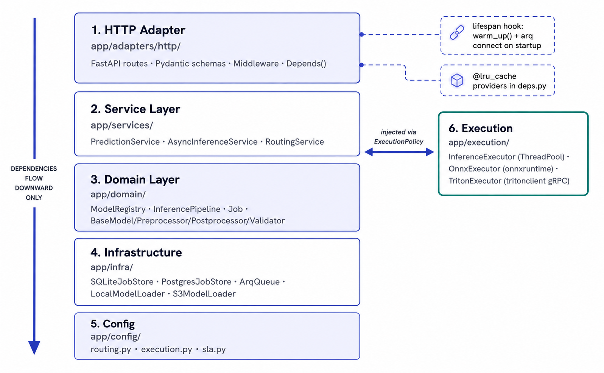

# Inference Engine

[](https://www.python.org/downloads/)
[](https://fastapi.tiangolo.com)
[](LICENSE)

Production-grade, task-agnostic ML inference backend. Serve any trained model — PyTorch, sklearn, ONNX, or anything else — over HTTP without changing the engine's core.

---

## Why Inference Engine?

Deploying a trained model to production means writing the same glue code every time: HTTP routing, job tracking, auth, rate limiting, async queues, observability. Inference Engine handles all of that so you only write the model logic.

Plug in a trained artifact. The engine handles the rest.

---

## Key Features

- **HTTP inference serving** — sync, batch, and async endpoints out of the box
- **LLM-assisted deployment CLI** — deploy a `.pkl`, `.onnx`, or PyTorch model in one command
- **Model versioning + routing** — static, canary, and A/B routing strategies
- **Async job queue** — arq + Redis with graceful in-process fallback
- **Multiple execution backends** — CPU thread pool, ONNX Runtime, Triton Inference Server
- **Authentication + scopes** — API key auth with per-tenant rate limiting
- **Observability** — Prometheus metrics, structured JSON logs, OpenTelemetry tracing
- **Zero-dependency quickstart** — runs with SQLite + in-process async, no Docker required

---

## Architecture



---

## Quickstart

```bash
git clone <repo>
cd inference-engine
uv sync          # or: pip install -e .

uvicorn app.adapters.http.app:app --reload

curl -X POST http://localhost:8000/predict \
  -H "X-API-Key: dev-key" \
  -H "Content-Type: application/json" \
  -d '{"model": "echo", "version": "v1", "data": "hello"}'
# → {"result": "hello"}
```

No Docker required. SQLite and an in-process thread pool handle everything locally.

---

## Deploy a Model in One Command

```bash
uv sync --extra cli
export GROQ_API_KEY=<your-key>

inference-engine deploy ./sentiment.pkl
```

The CLI inspects the artifact, generates `load()` and `predict()` via LLM, validates the pipeline, and writes the definition file — no boilerplate required.

Non-interactive (CI):

```bash
inference-engine deploy ./sentiment.pkl \
  --name sentiment --version v1 \
  --device cpu --routing static \
  --sample-input "this movie was great" \
  --yes
```

---

## Full Stack (Postgres + Redis)

```bash
cp .env.example .env
bash dev.sh
```

Starts Docker services, runs the DB migration, launches the arq worker, and starts uvicorn — all in one command.

---

## Documentation

| | |
|---|---|
| [Quickstart](docs/quickstart/installation.md) | Install, run, first request |
| [Guides](docs/guides/deploying-a-model.md) | Task-based workflows |
| [CLI](docs/cli/overview.md) | Deploy and fix commands |
| [API Reference](docs/api/overview.md) | Endpoint schemas |
| [Concepts](docs/concepts/architecture.md) | Architecture and design |
| [Configuration](docs/configuration/environment-variables.md) | Environment variables |
| [Integrations](docs/integrations/docker.md) | Redis, Postgres, Triton, ONNX |
| [Observability](docs/observability/metrics.md) | Metrics, logs, tracing |
| [Development](docs/development/local-development.md) | Contributing and testing |

---

## How It Compares

| | Inference Engine | BentoML | Ray Serve | SageMaker |
|---|---|---|---|---|
| Self-hosted | ✓ | ✓ | ✓ | ✗ |
| LLM-assisted deploy | ✓ | ✗ | ✗ | ✗ |
| Zero-dependency quickstart | ✓ | ✗ | ✗ | ✗ |
| Built-in auth + rate limiting | ✓ | ✗ | ✗ | ✓ |
| Async job queue | ✓ | partial | ✓ | ✓ |

---